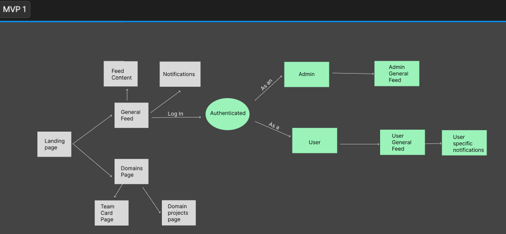
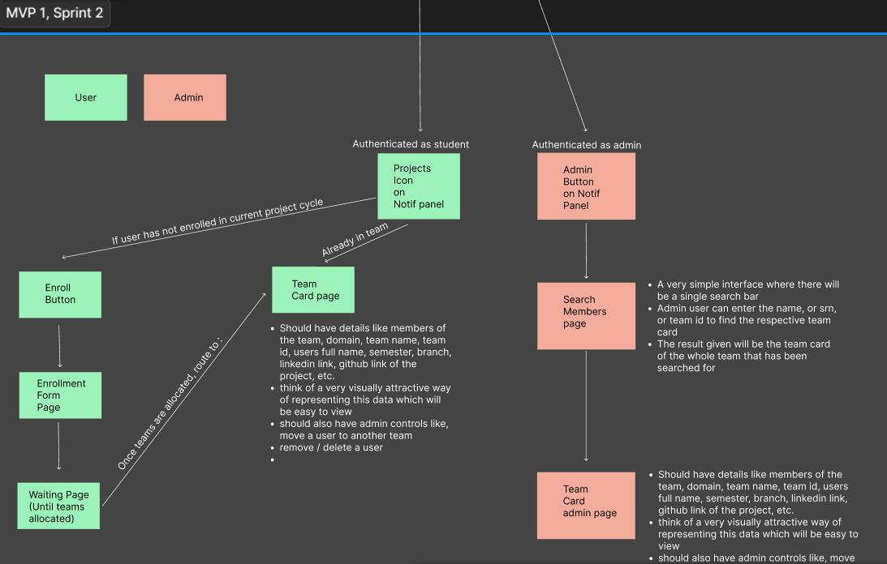

# System Architecture

## Overview

This document outlines the system architecture for the project, including the different user flows and interactions based on the two MVP diagrams.

## MVP 1 Architecture

The first Minimum Viable Product (MVP 1) establishes the core functionalities of the system, including user authentication, general feed access, and role-based content segregation.

### Workflow

- **Landing Page**: Entry point for users.
- **General Feed**: Displays feed content for all users.
- **Domains Page**: Users can explore different domains.
- **Authentication**: Users log in to access personalized content.
- **Roles**:
  - **Admin**: Access to the admin general feed.
  - **User**: Access to the user-specific feed and notifications.

### Architecture Diagram

## MVP 1, Sprint 2 Architecture

The second iteration (Sprint 2) introduces team management features, an enrollment system, and enhanced admin controls.

### Key Features

#### User Flow

- **Enrollment System**: Users can enroll in a project cycle.
- **Team Management**: Users can view details of their assigned teams.
- **Project Cycle Notifications**: Authenticated students see relevant project updates.

#### Admin Flow

- **Search Members**: Admins can search for users and view team details.
- **Team Management**: Admins can move users between teams and remove them.

### Architecture Diagram

